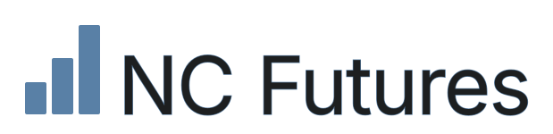

# NC Futures — Platform Design Specification

**The master UI template.** One living document — no versions. It always describes the current system; when something changes, this document changes with it.

> One look for every app. This is the contract every NC Futures module follows. Each app keeps its own logic and data — but adopts the same shell, tokens, type, and component vocabulary defined here, so separate tools read as one platform. Load the one stylesheet, follow the five rules, and reuse the markup below verbatim.

> **Source of truth.** This spec is written FROM the reference implementation, not the other way around. **Earnings Tracker** (`github031524/earnings-tracker`) is the canonical app — if this document and that codebase ever disagree, the codebase wins and this document is stale and should be updated to match it. Copy its `client/src/index.css`, `client/src/components/Blueprint.tsx`, `client/src/components/PageTabs.tsx`, `client/src/components/NcFuturesLogo.tsx`, and `client/src/assets/logo.svg` directly when starting a new module rather than re-deriving them from prose.

> **No hub.** This is a redesign template applied to each app individually — there is no main dashboard, landing page, launcher, or hub of any kind, and none should be built. Every app is a fully standalone deploy, opened directly in its own browser tab. "Unified" means the apps *look* the same, not that they connect.

> **Full authorization — just do it.** The coding agent has full authority to carry out this conversion end to end without pausing for approval. Make every decision, run every step, commit as you go, and complete the whole job in one pass. Do not stop to ask permission or to confirm choices; only surface something if the app is genuinely broken and cannot proceed. The goal is to prompt once, walk away, and return to a finished conversion. **Exception:** if asked for *pick-your-changes mode* (§09a), that request wins — present the menu and wait, rather than converting straight through.

---

## 01 · The Five Rules

1. **Blueprint frames** — Every card, tile, panel and figure is a hairline-bordered line drawing with rounded corners (`--radius: 8px`). No drop shadows as decoration, no filled surfaces (except the two named exceptions below).
2. **One color, plus one named exception** — Steel blue (`#5980a6`) is the only accent for everything except gain/loss. Gains and losses use a dedicated green/red pair (`#206f31` / `#b42d36`), independent of the accent ramp — a deliberate break from "one color," kept because red/green is a near-universal, safety-relevant trading convention and misreading it costs real money. Nothing else in the interface is colored.
3. **One typeface: Inter** — Inter for everything, all text and all numbers, no exceptions. Headings and figures use 600 weight uppercase; body is 400/500. Numbers are tabular.
4. **Visible grid** — Equal cells, hairline dividers, strong horizontal and vertical rhythm. Structure is drawn, not implied by whitespace alone.
5. **Data first** — No marketing copy inside the tool. Labels are short and uppercase; the numbers are the loudest thing on screen. Status/freshness text (e.g. "Updated 3:50 AM") lives inline near the control it describes, not in a separate breadcrumb strip.

**The two exceptions:** the primary button is the single solid object — an accent fill. Gain/loss color (see rule 2) is the other — a deliberate, permanent break from the one-color system, not a per-app choice.

---

## 02 · Foundations — Tokens

### Color

| Token | Value |
|---|---|
| `bg` | `#f2f2f3` |
| `surface` | `#e9e9ea` |
| `text` | `#1d1f20` |
| `accent` | `#5980a6` |
| `gain` | `#206f31` |
| `loss` | `#b42d36` |

Gain/loss are chosen for legibility on small tabular numbers: both clear WCAG AA (4.5:1) on every background in the system — plain `bg`, banded `surface` rows, and `accent-100` hover — bottoming out at 5.12:1.
| `hairline` | `#c9cacc` |

**Accent ramp:**

| Step | Hex |
|---|---|
| 100 | `#edf2f7` |
| 200 | `#dbe4ee` |
| 300 | `#c0d0e0` |
| 400 | `#8fa9c4` |
| 500 (base) | `#5980a6` |
| 600 | `#4d6f90` |
| 700 | `#3f5b77` |
| 800 | `#32485e` |
| 900 | `#253544` |

Light steps (100–300) for tinted fills and hovers; 500 is base; 700–900 for text on tint and pressed states.

**800 is the one accent value for text** — labels, micro text, table headers, tabs, field labels, tag text and ticker symbols all use it. Don't reach for 700 to make one kind of text "slightly different": 700 and 800 differ by only 1.34:1, so the distinction is invisible at body and label sizes while adding a second value to the ramp. 700 is left for the `:focus-visible` outline; 900 for pressed states.

### Type — Inter only

- `--font-heading` = Inter · 600 · UPPERCASE — headings, figures, labels
- `--font-body` = Inter · 400/500 — paragraphs, table cells, and all numbers

One typeface carries all text and numbers; both `--font-heading` and `--font-body` are set to Inter.

**Scale**

| Role | Size |
|---|---|
| Page title — a content entity (e.g. a ticker), **never the app name** | 34–40px |
| Section head | 15–16px, uppercase |
| KPI figure | 18px |
| Body | 13–15px |
| Label | 10.5px, uppercase, 0.13em tracking |
| Micro | 9–10px |

All numeric cells use `font-variant-numeric: tabular-nums`.

### Spacing & grid

- Space tokens `--space-1` … `--space-8` (3.4 → 27px, a 0.85× scale)
- **Radius is `8px` everywhere** — a deliberate, visible rounding. Not square.
- Content column max-width: `1680px`. Not full-bleed: unbounded width stretches table columns apart rather than adding useful density.
- Gutter: `clamp(16px, 3vw, 32px)`
- Content top/bottom padding: `clamp(16px, 3vw, 32px)`
- Card / tile grid gap: `clamp(12px, 1.5vw, 20px)`
- Table cell padding: `4px 10px` (`--table-cell-py` / `--table-cell-px`) — deliberately compact. Data density beats whitespace inside tables; this is the one place the 0.85× space scale is overridden.

---

## 03 · The Shell — Chrome Every App Inherits

**Two** fixed layers wrap every module — not three. An app only ever supplies the content region; the top bar is identical across all apps.

**A · Global top bar** — 48px, sticky, hairline base. Brand mark on the left, the Modules switcher centered, an optional account chip on the right.

**The switcher is labelled with the current app**, not the word "Modules" — it reads as a "you are here" marker that happens to be clickable. Clicking it drops down the full module list (§04b); clicking an entry there opens that app **in a new tab**, leaving the current one in place. The current app is listed too, marked as active (`aria-current="page"`) and not a link.

The top bar carries only the brand mark and the Modules switcher — no global search. There is no cross-app directory or shared backend, so global chrome that implies one is deliberately left out. Any navigation between an app's own views lives in the content region as `.tabs` (section 05/09); any search is local to that app's loaded data and built into its content region like any other component — never global chrome.

**There is no app context bar** — no breadcrumb or status strip as a second shell layer; don't build one. A page's own freshness/status indicator (e.g. "Updated Jul 19, 3:50 AM", a live refresh-progress pill) lives inline in that page's own toolbar row instead — see the Tracker recipe in §06 for the reference pattern.

**B · Content region** — the only part an app owns.

```html
<!-- In <head> — the shared favicon (§04a), so the browser tab carries the brand: -->
<link rel="icon" type="image/svg+xml" href="favicon.svg" />

<header class="topbar">
  <span class="topbar__brand"></span>
  <!-- Modules switcher — .topbar__modules keeps it absolutely centered in the
       top bar, dead-center regardless of the brand and account-chip widths on
       either side. The trigger is labelled with THIS app's name; the
       .blueprint--solid menu opens directly below it. -->
  <div class="topbar__modules">
    <button class="btn topbar__modules-trigger" aria-haspopup="menu" aria-expanded="false">
      Earnings Tracker ▾
    </button>

    <!-- Add [hidden] / remove it to close & open. Every entry opens in a new tab. -->
    <div class="topbar__modules-menu blueprint blueprint--solid" role="menu" hidden>
      <span class="topbar__modules-item" role="menuitem" aria-current="page">Earnings Tracker</span>
      <a class="topbar__modules-item" role="menuitem" target="_blank" rel="noopener"
         href="https://options-analyzer-production-24d8.up.railway.app/">Options Analyzer</a>
      <!-- … one <a> per remaining module, in the §04b order … -->
    </div>
  </div>
</header>

<main class="content">
  … APP CONTENT GOES HERE, INCLUDING THIS APP'S OWN TABS …
</main>
```

### Architecture

There is no shared console, no iframing, and no micro-frontend layer. Every app is a **fully standalone deploy** — it copies `styles.css` (and the shared `logo.svg`) into its own repo and reproduces the top bar locally, rather than mounting inside a parent shell. "Every app inherits the same chrome" means every app's markup matches, not that they run inside one host application.

There is no shared auth or shared data layer, implemented or implied. There is also no hub, launcher, or landing page tying the apps together — they are opened one at a time in separate browser tabs, and none should be created. Each app holds its own env-var API key and manages its own data independently.

---

## 04a · The Brand Mark

The logo is a **literal shared asset**, not a per-app redraw: three rising bars (accent-500 fill) beside the "NC Futures" wordmark, tight kerning (`NC` to `Futures` gap ≈ 2 SVG units at the reference's 600×150 viewBox; bar-to-text gap ≈ 20 units). Every app embeds the **exact same file**, unmodified — get it from `github031524/earnings-tracker:client/src/assets/logo.svg` (also mirrored as `logo.svg` in this design-spec repo). Render it at `height: 34.56px` in the top bar; width follows automatically from the SVG's aspect ratio.

Do not hand-recreate the mark as inline SVG shapes or a text lockup — use the file as-is.

**Favicon — required.** Every app also serves the shared favicon so its browser tab carries the brand: the three bars alone, cropped square (the wordmark is illegible at 16px). Copy `favicon.svg` from this repo unmodified — same rule as the logo, no per-app redraws — and declare it in `<head>`:

```html
<link rel="icon" type="image/svg+xml" href="favicon.svg" />
```

An app whose tab shows the browser's default globe icon is missing its favicon and out of spec.

---

## 04b · The Module Registry

The canonical list of modules. **Every app hardcodes this same list, in this order**, in its own switcher — there is no shared backend or directory to fetch it from (§03 Architecture). It's a copied constant, like `styles.css` and `logo.svg`.

| Module | URL |
|---|---|
| Options Analyzer | `https://options-analyzer-production-24d8.up.railway.app/` |
| Earnings Tracker | `https://earnings-tracker-production-2c77.up.railway.app/#/` |
| Custom Indexer | `https://indexer-production-83a6.up.railway.app/#/` |
| Stock Screener | `https://parabolic-screener-production.up.railway.app/` |
| PEAD | `https://pead-watchlist-e1a53.up.railway.app/` |
| Taiwan Screener | `https://taiwan-revenue-screener-production.up.railway.app/#/` |

```js
// Copy verbatim into each app; mark the current one with `current: true`.
export const MODULES = [
  { name: "Options Analyzer", url: "https://options-analyzer-production-24d8.up.railway.app/" },
  { name: "Earnings Tracker", url: "https://earnings-tracker-production-2c77.up.railway.app/#/" },
  { name: "Custom Indexer",   url: "https://indexer-production-83a6.up.railway.app/#/" },
  { name: "Stock Screener",   url: "https://parabolic-screener-production.up.railway.app/" },
  { name: "PEAD",             url: "https://pead-watchlist-e1a53.up.railway.app/" },
  { name: "Taiwan Screener",  url: "https://taiwan-revenue-screener-production.up.railway.app/#/" },
];
```

**Rules**

1. **Trigger label = the current app's name** — never the word "Modules".
2. **Entries open in a new tab** — `target="_blank" rel="noopener"`. The current tab never navigates away.
3. **The current app stays in the list**, rendered as inert text with `aria-current="page"` — not a link.
4. **The list is append-only in practice** — when a module is added, update this table and re-copy the constant into every app so all switchers stay identical. A switcher missing an app is stale, not a variant.
5. Names here are the display names — use them verbatim, and match the app's own title.

---

## 05 · The Blueprint Frame

```html
<div class="blueprint">
  … content …
</div>
```

**No corner registration marks.** A `.blueprint` is a plain hairline-bordered box with a rounded radius (`--radius: 8px`) — nothing more. Don't draw `+` crosshairs at the corners.

No inline padding needed — `.blueprint` already carries a sensible default (`--space-4`, 13.6px). Add `style="padding:..."` only to override it for a specific tile. Default spacing below each panel is also `--space-4` — override for tiles that need tighter stacking.

Use `.blueprint` on tiles, KPI cards, chart panels, filter asides, table wrappers, and floating panels (add `.blueprint--solid` for dropdowns/popovers that need an opaque fill so page content doesn't show through).

---

## 06 · Component Vocabulary

**Buttons & tags**

| Variant | Style | Class |
|---|---|---|
| Primary | accent fill | `.btn .btn-primary` |
| Secondary | neutral | `.btn` |
| Ghost | outline | `.btn .btn-ghost` |
| Icon (compact) | icon-only, tight padding | `.btn .btn-icon` |
| Tag | accent | `.tag .tag-accent` |

**KPI tile** — blueprint frame · label / figure / delta

```
REVENUE (TTM)
$92.8B
▲ +33.8% YoY
```

**Data table** — `.table`, numbers right-aligned and tabular, compact row padding (`4px 10px`). **Column headers are sticky**: rows scroll, the header row stays pinned just below the top bar so columns are always identifiable. (If a table lives inside its own scrolling box, pin to that box with `top: 0`.)

| METRIC | Q3'25 | Q2'25 | YOY |
|---|---:|---:|---:|
| Revenue | $24.8B | $22.7B | +33.8% |
| Free cash flow | $8.2B | $4.4B | −4.2% |

**Column-header tooltips** — every table column header carries a plain-language definition via the native HTML `title` attribute. **No custom tooltip component, no JavaScript, no CSS** — on hover (~1s browser delay) the browser renders its default tooltip: system font and size, positioned at the cursor. Styling is deliberately left to the browser/OS. The text states the metric's formula or meaning in one sentence:

```html
<th class="num" title="Trailing-twelve-month revenue, sum of the last four reported quarters">REVENUE (TTM)</th>
```

**Symbol / ticker link** — every ticker symbol shown anywhere (table cells, KPI tiles, headers, detail asides) is a clickable `.symbol` link to its TradingView chart, opened in a new tab. Never render a bare, unlinked symbol. URL pattern: `https://www.tradingview.com/chart/3Ojf0qKU/?symbol=<SYMBOL>` — the shared chart layout `3Ojf0qKU` with the symbol appended (case-insensitive), e.g. `?symbol=aapl`.

```html
<a class="symbol" href="https://www.tradingview.com/chart/3Ojf0qKU/?symbol=aapl"
   target="_blank" rel="noopener">AAPL</a>
```

**Open All (bulk chart review)** — every view that lists stock tickers carries an **Open All** button (`.btn`, secondary — never the page's primary). One click opens each listed ticker's TradingView chart (the §06 symbol-link URL) in its own browser tab, replacing N clicks with one full-depth review session:

- **Order-aware** — tabs open in the list's current sort/filter state, so the on-screen ranking becomes the review order.
- **Symbol-aware** — each ticker maps to the exchange-qualified symbol where needed (e.g. `NASDAQ:AAPL`, `TWSE:2330`, `LSE:VOD`), so US, Asian and European listings all resolve to the right chart.
- **Stocks only** — derived rows (benchmarks, totals, index lines) are excluded.
- **Guardrail** — above ~25 tickers, a confirmation dialog states the tab count before opening.
- **Affordance** — the button's tooltip warns that the browser's pop-up blocker must allow the site, since blockers typically permit only the first tab.

**Company name cell** — long names in a company column are shortened by a `shortenCompanyName(name)` transform, truncated by CSS, then marquee-scrolled on hover:

1. **Strip a leading "The"** — `The Kraft Heinz Company` → `Kraft Heinz Company`.
2. **Strip suffixes** — repeatedly remove trailing corporate suffixes and share-class/ADR noise until nothing more matches: `Inc` / `Inc.`, `Corp` / `Corporation`, `Ltd`, `LLC` / `L.L.C.`, `plc`, `Holdings` / `Holding`, `Group`, `Technologies` / `Technology`, `& Co` / `Co.` / `Cos.`, `Class A`, `Series A Preferred`, `Common Stock`, `American Depositary Shares` / `Receipts`, `ADR`, `ADS`, `Ordinary Shares (...)`, `Subordinate Voting Shares`. Loops until stable: `Foo Inc. Common Stock` → `Foo Inc.` → `Foo`.
3. **Cap to 3 words** — keep only the first 3 words that remain: `International Business Machines Corporation` → (strip `Corporation`) → `International Business Machines`.
4. **Truncate + marquee** — the company `<td>` uses `.company` (max-width `160px`); anything still too wide gets a trailing `…`. On hover it marquee-scrolls at a steady, readable speed to reveal the full shortened name (wrap the text in `.company__inner`). Honors `prefers-reduced-motion` — the §02 reset disables the scroll.

**Null case** — missing name → `shortenCompanyName` returns `null`; the cell renders an em-dash `—` in muted `var(--color-accent-800)` (#32485e).

```html
<td class="company"><span class="company__inner">International Business Machines</span></td>
```

`.company` is the named instance of the general **peek-marquee pattern** (stylesheet §16), usable on *any* fixed-width element whose text may overflow: fixed window (`max-width` + hidden overflow + `nowrap` + ellipsis), an inner `inline-block` span, and on hover ellipsis→clip plus a `translateX` animation ending at `min(0px, calc(window − 100%))` — the text slides left exactly until its last character reaches the window's right edge, and text that fits never moves. `6s linear infinite alternate` (tune `--marquee-speed`): a slow back-and-forth **pan**, not a looping ticker tape; layout never shifts, and mouse-out snaps back to the ellipsis. Reduced-motion users get the static ellipsis (§02 reset). The window width is declared once as `--peek-window` and inherited into the keyframe — override the variable per instance rather than restating the width; if the width is dynamic (resized columns, §08a), regenerate `--peek-window` from the live width or accept slight under/over-travel.

**Tabs** — e.g. `WATCHLIST` · `UPCOMING`. In the reference app these live centered inside the page's own toolbar row (a 3-zone flex layout: existing left content, centered `.tabs` via `absolute left-1/2 -translate-x-1/2` within a `relative` toolbar container, existing right content) — not a dedicated shell row.

**Filter field** — `.field .input` (e.g. "Min YoY growth" → `+20%`)

**Status/freshness pill** — a small `.tag`-style element (border-accent-500, bg-accent-100, uppercase micro text) placed inline in a page's toolbar, next to the action it describes (e.g. "Updated 3:50 AM" beside a "Refresh Data" button).

---

## 07 · Layout Recipe Per App Type

Pick a recipe by **interaction pattern**, not by subject matter. A page that lists tickers isn't automatically Tracker — Tracker is specifically for date/calendar-grid data. A sortable watchlist or discovery table is Screener or List/Builder. If a page genuinely matches none of the five below, define a new named recipe rather than forcing the nearest one.

**No app-name page title.** The switcher in the top bar already names the current app (§03), so repeating it as a heading in the content region is redundant — don't render one. Every recipe below starts at its first working element (a toolbar, a filter aside, a dropzone), not at a title bar. A `.title` is only for a **content entity** the page is about — a ticker on a detail page, an index name on a builder page — never the app's own name.

**Dashboard / detail** *(a single ticker's full picture)*
Entity title (the ticker — not the app name) + price/status row → tabs → KPI tile row → chart panel + profile aside (2.1 : 1).

**Screener** *(e.g. Taiwan Revenue · Parabolic)*
Filter aside (260px, blueprint) + results table. Primary "Run / Scan" button in the aside.

**Tracker / calendar** *(e.g. Earnings Tracker — the reference app)*
Toolbar row: left content (e.g. a list/view selector) → centered `.tabs` → right content (action buttons). A second toolbar-style row below carries the primary input (e.g. "Add Symbols") plus a leading count/status pill. Below that: the results table, wrapped in `.blueprint`, with drag-to-resize columns (see §08a) and row banding by date group.

**List / builder** *(e.g. Indexer)*
Master table (1.5) + detail aside (1) with a headline figure and holdings list. "New" primary button in the header.

**Upload / analyze** *(e.g. Options Position Analyzer)*
Status row → dropzone (blueprint, collapses to a slim "add another" bar once data is loaded) → KPI tile row → full-width chart panel → results table below. For tools where the input is a file/screenshot rather than a filter or ticker search.

---

## 08a · Optional: Resizable Table Columns

The reference app's tables support drag-to-resize columns with persisted widths — not required by the spec, but available as a pattern if a module's table has many columns:

- Column widths stored in component state, seeded from a `COLUMNS` config array, persisted to `localStorage` under an app-specific key.
- `<table class="table" style="table-layout:fixed; width:<sum>">` with a `<colgroup>` of `<col style="width:...px">` per column, driven by that state.
- A `ResizeHandle` — an absolutely-positioned `6px`-wide strip at the right edge of each resizable `<th>`. **Invisible at rest — no border, no vertical line.** The affordances are `cursor: col-resize` over the strip and an accent tint that appears on hover and stays while dragging. Nothing is drawn when the column is not being resized.
- Drag updates width via `mousemove`/`mouseup` listeners on `window`, clamped to a `40px` minimum.

---

## 08b · Row Banding & Grouping

For tables whose rows fall into natural groups (e.g. every ticker reporting on the same earnings date). All colors below are existing tokens — no new hues introduced for this pattern.

| Purpose | Value | Token |
|---|---|---|
| Default row background | `#f2f2f3` | `--color-bg` |
| Alternating band (every other group) | `#e9e9ea` | `--color-surface` |
| Row hover | `#edf2f7` | `--color-accent-100` (`.table tbody tr:hover`, §08 — always wins over banding) |
| Standard row divider | `#c9cacc` (1px) | `--hairline-color` (`.table td` default, §08) |
| Group-gap divider | `#5980a6` (2px) | `--color-accent-500` |

**The rule, not just the colors:**

1. Assign each row's *group* (not each row) a stable index in the order groups first appear — e.g. group by earnings date, in the order rows are sorted.
2. Alternate background by that group index: even groups plain `bg`, odd groups `.row-band` (`--color-surface`). All rows within one group share the same background — the band marks the group, not the row.
3. Between the **last row of a group** and the first row of the next, check whether the groups are "adjacent" by whatever ordering the table uses (e.g. consecutive calendar days for a date-grouped table, consecutive ranks for a leaderboard). If they're adjacent, draw the normal 1px hairline. If there's a gap, apply `.row-groupgap` instead — the heavier 2px accent-colored rule — so the table visually breaks into clusters (e.g. "this week" vs "next week").
4. Hover always overrides banding — declared after it in the stylesheet at equal specificity, and only ever active on the row under the cursor.

Utility classes for this are in `styles.css` §14 (`.row-band`, `.row-groupgap`) — apply them per-row from the page's own grouping logic; the stylesheet doesn't compute the grouping itself, since that's data-driven and differs per app (dates, ranks, categories, etc).

---

## 09 · Converting an Existing App

Converting means full replacement, not coexistence. Adopting this spec retires any prior theme, palette, or component library entirely — there is no compatibility mode that keeps old branding alongside the blueprint system. Proceed with the full replacement; the old look is being retired on purpose.

**Authorization:** the agent is fully authorized to complete every step below without stopping for approval. Where the prose says "raise it before starting" or "tell me which path you're taking," instead pick the sensible option, note the choice in your commit message, and keep going — do not block on it. This is overridden only by an explicit request for **pick-your-changes mode** (§09a).

### Step 0: inventory before touching anything

Before converting *or* rebuilding, have the coding agent read the current codebase — not recall the original prompt — and produce a written inventory: every route, every data flow, every business rule, every validation and edge case it can find. This inventory becomes the acceptance checklist for whichever path you take next.

**Retrofit vs. rebuild:** default to retrofitting incrementally — one step at a time, with a build/test and a git commit after each. Reach for a full ground-up rebuild only if the inventory pass shows the old theme is genuinely inseparable from the business logic throughout. Either way, check the result against the Step 0 inventory before calling it done — that's what actually prevents silent regressions.

1. Link `styles.css` and copy `logo.svg` + `favicon.svg` (with its `<head>` link tag, §04a); wrap the app in the global top bar (brand mark + Modules switcher only — no context bar).
2. Swap every font to Inter — all text and numbers, no exceptions; uppercase every heading.
3. Recolor to tokens only — kill every stray hex, gradient and shadow. Use the hex values in §02.
4. Reframe every card/panel as `.blueprint` — hairline border, `8px` radius. **Do not add corner registration marks.**
5. Right-align numeric columns; set `tabular-nums`.
6. Gains → `#206f31`, losses → `#b42d36`. Nothing else colored.
7. Delete descriptions and sell copy; labels become short uppercase. Any status/freshness text moves inline into the relevant toolbar row (no context bar to put it in).
8. Buttons → `.btn` (+ `.btn-primary` / `.btn-ghost` / `.btn-icon` as needed); inputs → `.input`; tables → `.table`. Page-local tabs → `.tabs`, centered in a toolbar row per §06.
9. Wrap every ticker symbol in a `.symbol` link to its TradingView chart (`…/chart/3Ojf0qKU/?symbol=<SYMBOL>`, opened in a new tab) — no bare symbols anywhere.
10. Delete any heading that repeats the app's own name — the top-bar switcher already names it. Keep a `.title` only when it names a content entity (a ticker, an index).
11. Shorten company-name cells with `shortenCompanyName` (strip a leading "The", loop-strip suffixes/share-class noise, cap to 3 words) and the `.company` cell (160px, ellipsis, marquee-on-hover); missing names render `—` in muted accent-800.
12. Add an **Open All** button to every ticker-list view (§06) — current sort order, exchange-qualified symbols, stocks only, confirm above ~25 tabs.
13. Give every column header a native `title` tooltip (§06) — one sentence, the metric's formula or meaning; no custom tooltip component.

**Acceptance test:** put the converted app beside Earnings Tracker. If the top bar, type, frame treatment (no corners, `8px` radius) and number treatment are indistinguishable and only the content differs, it passes visually — but also re-check it against the Step 0 inventory to confirm nothing functional was lost along the way.

---

## 09a · Pick-Your-Changes Mode

An opt-in conversion: instead of converting straight through, the agent presents the proposed changes as a **clickable menu** and applies only the ones ticked. Use it when adopting the system gradually, or on an app where some of the old UI should survive.

**This mode overrides the "full authorization / just do it" clauses** in the header and §09. Do not edit, commit or push before the selection comes back.

### Protocol

1. **Inventory first (silently).** Run §09 Step 0 — read the codebase and inventory every route, data flow, business rule, validation and edge case. Keep it internal; don't print it. It stays the acceptance checklist.
2. **Present the menu.** Offer the applicable changes as selectable options via `AskUserQuestion`, grouped by area, **multi-select on**. The tool caps a round at 4 questions × 4 options, so run several rounds until every area is covered. Skip areas the app doesn't have — never show a "symbol links" option to an app with no tickers.
3. **Keep labels short** — see *Writing the options* below. This is the part that most often goes wrong.
4. **Apply only what's ticked.** Anything unticked is left exactly as-is, and is not raised again or "improved" in passing.
5. **Report** in one short block: what was applied, what was skipped by choice, and anything the selection makes inconsistent (see below).
6. Then commit, push, PR, merge as normal.

### Writing the options

The menu is for scanning, not reading. Hard limits:

- **Label: 5 words max**, in `old → new` form.
- **Description: one short line**, ~12 words max.
- **No jargon** — no CSS class names, no `§` references, no "blueprint", "token", "hairline" in the label.

| Too long | Right |
|---|---|
| Cards currently have drop shadows and rounded corners; they become hairline-bordered blueprint frames with an 8px radius | **Shadowed cards → hairline frames** |
| Replace the existing typeface with Inter for all text and numbers, with uppercase headings | **All fonts → Inter** |
| Wrap every ticker symbol in a link to its TradingView chart, opened in a new tab | **Symbols → TradingView links** |
| Remove the page heading that repeats the app's name since the switcher already shows it | **Drop app-name heading** |
| Convert tables to the platform table style with compact row padding and right-aligned numeric columns | **Tables → compact, numbers right** |

If a change can't be said in 5 words, it's two changes — split it.

### Suggested grouping

| Group | Changes offered |
|---|---|
| Shell | Top bar + brand mark · Modules switcher (§04b) · favicon (§04a) · remove app-name page title |
| Type | Inter everywhere · uppercase headings · tabular numbers |
| Color | Recolor to tokens · gain/loss pair · strip stray hex, gradients, shadows |
| Frames | Cards/panels → `.blueprint` hairline + `8px` radius |
| Tables | `.table` + compact density · right-aligned numerics · row banding · resizable columns · header tooltips |
| Controls | Buttons → `.btn` · inputs → `.input` · page tabs → `.tabs` in a toolbar row |
| Data cells | Symbols → TradingView links (§06) · company-name shortening + marquee (§06) · Open All on ticker lists (§06) |
| Copy | Delete sell copy · labels to short uppercase · status text inline |

### Dependencies

Some picks imply others — say so in the option text rather than silently pulling extras in:

- **Modules switcher** needs the **top bar**. Offer the bar first; grey the switcher out if the bar is declined.
- **Company-name marquee** needs the **company cell truncation** — it's one option, not two.
- **Row banding** and **resizable columns** both need the table converted to `.table` first.
- **Gain/loss colors** are part of the color group; picking "tokens only" without them leaves gains/losses uncolored — flag that.

A partial selection is a legitimate end state, not a half-finished job. But if the result is visibly inconsistent — new frames beside old shadowed cards, Inter beside the previous typeface — note it plainly in the report so the choice is informed. Do not fix it unasked.
